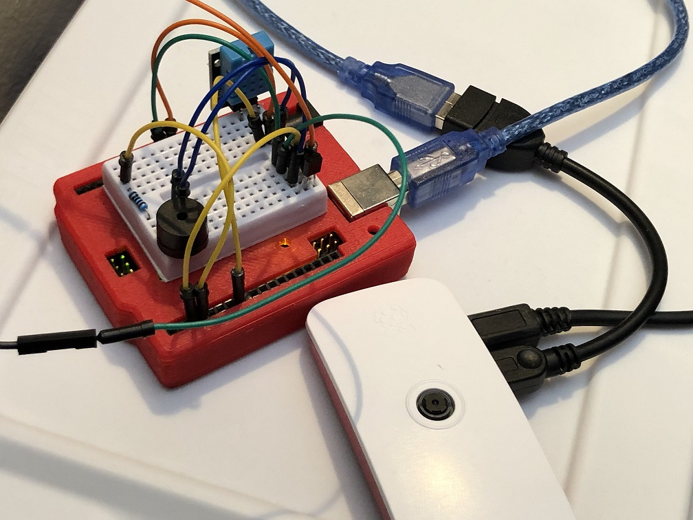
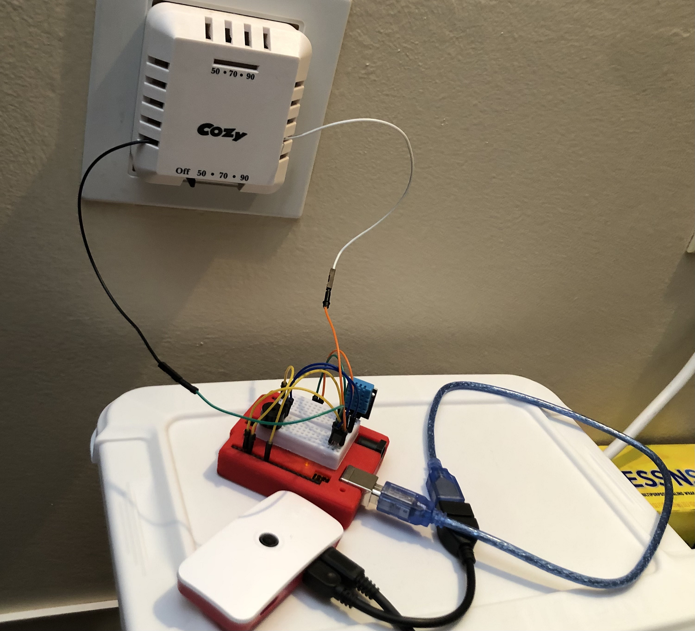
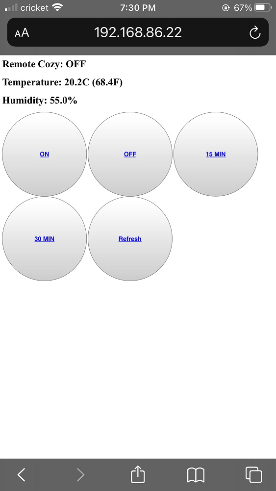

# RemoteCozy
Turn an old gas wall heater to the smart one with arduino and raspberrypi.

Before jumping into the *dirty* work in this repo, check for possible **Nest solutions** [here](https://www.youtube.com/watch?v=rsqniOCdglw) and [here](https://www.youtube.com/watch?v=NZbpdGksut4)

Make sure you are well aware of how gas wall heater work before change the circuit.

**Pictures for the arduino circuit, pi-arduino-gasSwitch circuit and the control page.** 

 
 

